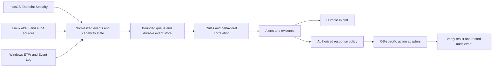

# Enhancement roadmap: advanced macOS and Linux, Windows foundation

**Date:** 2026-09-15  
**Status:** Implementation in progress. See [nine-commit delivery status](IMPLEMENTATION.md) for implemented slices and remaining exit gates.
**Baseline:** [Code review](CODE_REVIEW.md), commit `97345b8714e6678c61b6a322af8a8916a869e408`.

## Intended outcome

Deliver a dependable endpoint agent with useful native macOS and Linux telemetry, explainable detection and controlled response, plus an installable Windows service framework. Retain the Go daemon, existing detection code where validated, protobuf IPC, and out-of-process plugins. Expand capabilities through explicit OS adapters rather than adding more independent service stubs.

Windows's first milestone is service lifecycle, secure local administration, event collection, inventory/posture, and shared telemetry integration. Full Windows prevention, custom kernel drivers, minifilters, and unrestricted protected-process memory access are beyond this roadmap's initial Windows commitment.

### Proposed qualification scope

These are engineering targets, not claims of current vendor support or already-tested compatibility. Phase 1 must record exact OS builds, architectures, kernels, and toolchain versions used for release qualification.

| Platform | Initial qualification target | Capability boundary |
| --- | --- | --- |
| macOS | Apple Silicon first; Intel only on OS/hardware combinations retained in the support matrix | Signed Endpoint Security extension; posture/inventory fallback when native access is unavailable |
| Linux | Ubuntu/Debian and RHEL-compatible families; amd64 and arm64 | eBPF on qualified kernels; explicit audit/journal/polling fallback where supported |
| Windows | Windows 11 x64 and Windows Server 2022/2025 x64 as proposed lab targets | User-mode service, secure IPC, ETW/Event Log and registry/inventory providers; arm64 is a later qualification target |

### Architecture direction

Availability is separate from health and policy. Each capability reports supported/unavailable, enabled/disabled, active/degraded, reason, last successful observation, and loss counters. Empty data is not evidence that a host is safe. Only verified execution may produce a successful action result.

## Phase overview

| Phase | Deliverable | Dependencies | Review findings addressed |
| --- | --- | --- | --- |
| 1 | Reliable core, honest API contracts, working build gates | None | R01, R02 mitigation, R03, R08 compile blocker, R11, R12, R14; R04/R06/R10 capability gating |
| 2 | Shared events, durable delivery, usable detection pipeline | 1 | R04, R05, R13 |
| 3 | Advanced macOS sensor and posture support | 2; Apple signing/access prerequisites | R10; macOS portion of R04 |
| 4 | Advanced Linux sensor, posture, and firewall foundation | 2 | R02 Linux, R04 Linux, R06 |
| 5 | Windows service and telemetry foundation | 2 | R08 runtime, R09, R02 Windows, R04 Windows |
| 6 | Verified response, policy, and unified plugin integration | 2 plus each relevant platform phase | R01 completed actions, R06 response, R07, R12 enforcement |
| 7 | Platform qualification, packaging, and staged rollout | 3–6 | R14 release validation and regression coverage for all findings |

After Phase 2, the three platform phases can be developed independently if staffing permits. The numbering defines delivery milestones, not a requirement to leave Windows compile checks until Phase 5. Begin Apple entitlement/signing preparation in Phase 1 because it may have external lead time.

## Phase 1 — Make the core trustworthy

**Goal:** a buildable, diagnosable agent that never represents missing functionality as protection.

**Implementation work**

1. Repair the existing test baseline: health enum serialization, plugin error formatting, beacon/memory test interfaces, and DNS scoring fixtures. Establish documented expected detector behavior before changing assertions.
2. Align CI with `go.mod`, real Makefile targets, and one artifact layout. Add explicit daemon/CLI cross-build checks and native test jobs. Enumerate nested modules and distinguish GUI, plugin, and sensor build variants.
3. Split POSIX/Windows ownership and service code so the Windows daemon and CLI compile. Add capability interfaces beside `internal/platform/Platform` for event collection, posture, and response without forcing every OS to implement everything.
4. Replace successful stubs with typed unsupported/unavailable responses. Aggregate daemon health from actual service state. Make bulk threat lookups share the individual lookup implementation.
5. Validate configuration, dependencies, storage backends, positive intervals, and unsupported combinations before startup. Add rollback of partial startup, idempotent stop, bounded shutdown, and safe configuration replacement. Respect disabled-service settings.
6. Persist macOS patch first-observed dates and introduce explicit unknown compliance for missing collection. Gate ineffective enforcement until it is implemented. Fix lockdown's mutex recursion.
7. Inventory privileged interfaces and platform paths. Protect the local web API, unify daemon/CLI identity location, and document credential/certificate ownership. Start entitlement and signing preparation.

**Main code areas:** `internal/daemon`, `internal/service/service.go`, `internal/ipc`, `internal/platform`, `internal/plugin`, `internal/models/config.go`, `internal/identity`, `.github/workflows`, `Makefile`.

**Exit gate**

- Core tests and applicable race checks pass with normal vet enabled; Windows daemon/CLI compile.
- Unknown service/scan, failed sensor initialization, and unavailable patch sources never return successful protection or compliant status.
- Failed storage/IPC startup unwinds cleanly; repeated stop does not panic; reload validation preserves the prior working configuration on failure.
- A patch keeps its deadline across scans/restarts, and every API success is backed by an observable operation or data source.

**Deliverables:** passing core CI, capability matrix, lifecycle/IPC regression tests, reproducible build instructions, first platform support matrix.

## Phase 2 — Connect events, detection, and durable delivery

**Goal:** prove one complete collection-to-alert workflow before increasing sensor coverage.

**Implementation work**

1. Define a versioned event envelope: event ID, endpoint/boot ID, source, event/ingest times, process identity including start time, parent identity, user identity, file/network details, and collection quality. Retain OS-specific extensions for fields that do not map cleanly.
2. Add bounded ingestion and explicit overload behavior. Use a persistent event/outbox store, preferably SQLite through the dependency already present, with schema migrations, retention, corruption recovery, disk quotas, and restart replay. Keep existing JSON configuration/state compatible through a migration adapter.
3. Wire process/network observations into beacon analysis and rule evaluation. Wire native ES/ETW providers into the same interfaces as they become available. Expose events, detections, and query pagination through IPC and the dashboard.
4. Repair DNS log EOF/rotation and format parsing. Keep unimplemented pcap/ETW capture unavailable. Document that encrypted DNS visibility depends on the chosen source and is not equivalent to complete DNS inspection.
5. Connect SIEM/Protector export to actual events; acknowledge delivery, retry with backoff, and deduplicate with stable IDs. Report source gaps and dropped events instead of hiding them.
6. Establish deterministic replay fixtures for normal software activity, beaconing, DNS tunneling, persistence changes, and file events. Make alerts include evidence, rule version, and an explanation. Keep anomaly/ML scores advisory until evaluated against these fixtures.

**Main code areas:** new `internal/events` and durable-store adapter; `internal/models`, `internal/storage`, `internal/service/{process,conntrack,dnstunnel,siem,behavior,ml_engine}`, `internal/behavior`, `internal/ipc`.

**Exit gate**

- A fixture event reaches storage, a detector, the API, and an export test receiver with the same event identity.
- Idle log files, rotation, duplicate/reordered events, PID reuse, and clock skew have defined behavior.
- A receiver outage followed by daemon restart replays accepted local events without logical duplicates.
- Load tests demonstrate bounded memory/disk use and visible loss counts at the declared capacity; loss accounting distinguishes source loss from queue/export loss.

**Deliverables:** event schema, replay corpus, durable outbox, detector integration, coverage/latency/loss metrics.

## Phase 3 — Deliver native macOS depth

**Goal:** useful process/file/persistence visibility and accurate macOS posture with platform security enabled.

**Implementation work**

1. Replace the broken ES build path with a maintained native component. Prefer an Endpoint Security system extension packaged with a small installer/management app; connect it to the Go daemon with authenticated local transport. Isolate native code and version the bridge protocol.
2. Collect process exec/fork/exit plus selected file create/write/rename/unlink and mount events. Preserve parent identity, audit-token identity, executable signing identity, and event sequence information where available. Bound callback work and expose event drops.
3. Add launchd and login-item persistence inventory/change detection; measure FileVault, SIP, Gatekeeper, firewall, and software-update posture with explicit permission/error states. Consolidate overlapping `plugins/osx-security` collectors instead of silently collecting twice.
4. Improve application/software-update inventory and stable patch metadata. Expose reduced coverage for protected data or unavailable permissions. Use file/on-disk scanning where appropriate; do not represent inaccessible process memory as a clean scan.
5. Add Network Extension integration as a separately capability-gated network/DNS provider if its scope and entitlement are available; preserve a documented reduced-visibility mode otherwise.
6. Package/sign/notarize native components, provide launchd lifecycle and managed deployment profiles, and handle upgrades and permission revocation. Test sleep/wake, logout, and daemon/extension reconnection.

**Platform basis:** Apple documents Endpoint Security event notification/authorization, system-extension packaging, and the required entitlement. Its sample installation also requires granting Full Disk Access. The proposed packaging follows these mechanisms. [Endpoint Security](https://developer.apple.com/documentation/endpointsecurity), [Apple sample setup](https://developer.apple.com/documentation/endpointsecurity/monitoring-system-events-with-endpoint-security), [System Extensions](https://developer.apple.com/system-extensions/).

**Main code areas:** `internal/platform/darwin/esf`, `internal/platform/macos`, `internal/service/esf`, `internal/service/persistence`, `plugins/osx-security`, new native packaging/bridge targets.

**Exit gate**

- A signed installation on each qualified Mac architecture emits attributed process/file events with SIP enabled.
- Extension approval, missing Full Disk Access, entitlement failure, and permission revocation produce actionable capability states.
- Harmless launch-agent creation and executable/file fixtures generate explainable alerts.
- Upgrade, reboot, sleep/wake, and uninstall are tested; no sensor build is labeled supported solely because the minimal daemon compiles.

**Deliverables:** macOS native sensor release candidate, posture providers, signed package, installation/permission guide, native integration results.

## Phase 4 — Deliver native Linux depth

**Goal:** reliable host/container visibility across qualified Linux distributions and kernels.

**Implementation work**

1. Implement and embed real eBPF programs using the existing Cilium dependency and `bpf2go`; use CO-RE relocations where appropriate. Probe required kernel features/BTF and permissions before activation; record attachment failures and loss counters.
2. Start with process lifecycle and network connection telemetry, then selected file/persistence activity. Enrich events with namespaces, cgroups, container identity, UID/GID, and executable metadata. Avoid assuming a PID is globally unique.
3. Provide explicitly labeled audit/journal/polling alternatives for qualified hosts lacking the required eBPF capabilities. Deduplicate overlapping sources and publish their coverage differences.
4. Implement Debian/Ubuntu and RPM-family inventory/update adapters. Handle package-manager exit codes and locks, repository failures, advisory severity, reboot requirements, and unknown release metadata. Begin with assessment; schedule installation through the later response policy.
5. Consolidate nftables control in owned tables/chains. Validate atomic policy changes and preserve established/management traffic and other firewall owners. Make any iptables fallback explicit and tested.
6. Add systemd hardening compatible with the actual sensor privileges, SELinux/AppArmor posture, persistence checks, and `.deb`/`.rpm` installation paths. Keep runtime privileges scoped to the enabled sensors/actions.

**Platform basis:** Cilium provides Go loading and `bpf2go` generation; CO-RE portability still requires qualifying actual kernel features and type information. [Cilium eBPF](https://github.com/cilium/ebpf), [portability guide](https://ebpf-go.dev/guides/portable-ebpf/), [kernel CO-RE overview](https://docs.kernel.org/bpf/libbpf/libbpf_overview.html).

**Main code areas:** `internal/service/ebpf`, new BPF sources/generated bindings, `internal/platform/linux`, `plugins/firewall-linux`, `internal/service/{persistence,device_control}`, systemd and package definitions.

**Exit gate**

- Native VM tests cover the selected distribution/kernel matrix on amd64 and arm64, including a host without required eBPF support.
- A short-lived process and a container connection are attributed and exported; unsupported collection is visibly degraded.
- Package fixtures distinguish pending, current, failed, and unknown assessment states.
- Firewall application/rollback preserves management connectivity, IPv6 behavior, and pre-existing rules. Sensor teardown leaves no owned attachments behind.

**Deliverables:** real Linux sensors, distribution adapters, tested firewall backend, hardened unit, native package candidates.

## Phase 5 — Establish the modern Windows foundation

**Goal:** an installable, manageable user-mode Windows agent that feeds the shared pipeline.

**Implementation work**

1. Complete the Windows Service Control Manager adapter: readiness before reporting Running, StopPending progress, wait for daemon cleanup, recovery settings, Event Log integration, and tested configuration changes.
2. Implement named pipes with explicit ACLs and compatible CLI dialing. Use native ProgramData paths and Windows ownership/ACL validation for state, configuration, plugins, and credentials. Optional network administration must use a separate authenticated TLS configuration.
3. Turn existing ETW process/DNS consumers into normalized event providers. Wait for consumer readiness, propagate startup failures, count lost events, and recover sessions. Add Event Log subscriptions for selected security/system events without silently changing audit policy.
4. Implement read-only inventory/posture through appropriate Windows APIs: installed software, Defender/firewall status, BitLocker state, and Windows Update assessment. Report Server-specific unavailable providers explicitly.
5. Add persistence inventory for Run keys, services, and scheduled tasks, including relevant registry views. Correlate changes with the shared process model and retain Windows user/SID context.
6. Produce a signed installer candidate with service registration, repair/upgrade/uninstall, data ACLs, and versioned configuration migration. Validate coexistence with Defender and an ordinary unprivileged local account.

**Platform basis:** Windows named pipes support explicit security descriptors; the default descriptor is not a sufficient product-specific access policy. ETW uses controllers/providers/consumers and can lose events, so readiness and loss metrics are part of the design. [Named-pipe security](https://learn.microsoft.com/en-us/windows/win32/ipc/named-pipe-security-and-access-rights), [ETW overview](https://learn.microsoft.com/en-us/windows/win32/etw/about-event-tracing), [Windows services](https://learn.microsoft.com/en-us/windows/win32/services/about-services).

**Main code areas:** `cmd/afterdark-darkd/service_windows.go`, Windows IPC adapter, `internal/platform/windows`, `internal/service/{etw,registry,svcmon}`, Windows installer and CI definitions.

**Exit gate**

- Windows 11 and selected Server VM installations start at boot, report actual readiness, and stop only after bounded cleanup.
- Admin CLI works using defaults; unauthorized pipe/config/plugin access is denied.
- A benign process, DNS lookup, and persistence-change fixture reaches the same store/detection/export interfaces used by macOS/Linux.
- Update/posture failures are unknown/degraded, and ETW failure never masquerades as active coverage.

**Deliverables:** Windows foundation release candidate, signed installer candidate, secure local IPC, initial event/posture providers, native service integration tests.

## Phase 6 — Add verified response and unify plugins

**Goal:** turn detections into controlled, observable actions without claiming enforcement that an OS adapter cannot provide.

**Implementation work**

1. Complete host support for the firewall plugin interface, version negotiation, configure/start/stop, cancellation, health, and typed errors. Consolidate duplicate SDK/host contracts and validate plugins using platform-native trust/permissions.
2. Define response requests with action ID, caller/tenant identity where applicable, target identity, preconditions, expiration, policy version, and idempotency key. Revalidate process identity immediately before acting to avoid PID reuse errors.
3. Implement policy-authorized macOS/Linux IP blocking, file quarantine/restore, and process termination where supported. Use actual OS state to verify the result and retain evidence/audit records. Keep initial Windows response behind explicit capability gates until separately validated.
4. Add dry-run and scoped rollout policies, management-channel exemptions, timeout/rollback for isolation, and recovery paths. Restrict privileged operations to a narrow adapter boundary; plugins and scripts do not receive arbitrary privileged command access by default.
5. Wire service control, scans, configuration reload, and shutdown RPCs to real lifecycle operations. Add action status/history to the CLI/dashboard and cancellation for long-running work.
6. Add opt-in prevention only after observe-mode validation. macOS ES authorization needs bounded decision time; Linux enforcement requires a specifically supported backend. Do not treat detection-only eBPF/ETW as universal process prevention.

**Main code areas:** new response/policy module; `internal/plugin`, `pkg/pluginsdk`, `plugins/firewall-*`, `internal/ipc`, `internal/service/{app_lockdown,canary,filehash}`, `internal/scripting`.

**Exit gate**

- Real host/SDK subprocess tests cover compatible/incompatible plugins, failure, cancellation, and restart.
- Benign response fixtures demonstrate verified block/unblock and quarantine/restore with audit evidence; unsupported actions return explicit errors.
- Replayed, expired, unauthorized, and stale-process actions cannot produce unintended effects.
- Isolation rollback restores management connectivity within the declared timeout, including after a daemon restart.

**Deliverables:** response API, policy schema, working firewall host integration, reversible macOS/Linux controls, action audit UI/CLI.

## Phase 7 — Qualify releases and staged deployment

**Goal:** ship only capabilities proven on the platform matrix, with a recovery path for field failures.

**Implementation work**

1. Run native integration suites on qualified macOS, Linux, and Windows systems; include nested modules, signed sensors, installers, upgrades, and uninstalls. Cross-builds remain a fast gate, not runtime proof.
2. Test complete benign scenarios: process start → event → correlation → alert → export; and authorized alert → response → verified OS state → rollback. Include permission denial, event storms, offline operation, disk pressure, and sensor restart.
3. Establish release performance budgets after Phase 2 measurements. Initial proposed targets: idle CPU below 2% of one core, daemon RSS below 250 MiB, and p95 event-to-local-alert latency below 2 seconds at the declared normal load. Measure native components separately and combined; revise budgets explicitly for memory scans and heavy workloads.
4. Require a 24-hour soak with bounded memory/queue/disk growth, no deadlocks, and accurate source/delivery loss accounting. Test power interruption and upgrade rollback of configuration/schema changes.
5. Produce signed/notarized macOS packages, signed Windows installers, and signed Linux packages with checksums, SBOM, version metadata, and dependency scanning. Verify update authenticity and reject incompatible/downgrade packages according to policy.
6. Roll out through internal lab → small pilot → expanded fleet. Advance only when capability coverage, crash rate, delivery lag, and resource budgets meet the release criteria. Document diagnostics and recovery commands per OS.

**Exit gate**

- Every advertised capability links to a passing native scenario and a documented support boundary.
- Install/upgrade/uninstall, offline replay, rollback, and restart pass on the published matrix.
- All P1 findings are closed with regression evidence; any remaining P2 issue has an explicit release disposition.
- macOS/Linux advanced support and Windows foundation are labeled separately in release notes and the UI.

**Deliverables:** qualified packages, CI evidence, support/capability matrix, release notes, deployment runbooks, pilot report.

## Decisions and scope controls

- **Retain and integrate:** Go daemon, gRPC, platform factories, validated detectors, and process-isolated plugins.
- **Consolidate:** overlapping sensor/behavior services, duplicated plugin contracts, platform paths, and fragmented export queues.
- **Choose durable delivery deliberately:** SQLite is a proposed endpoint store, not an assertion that the existing storage factory supports it. Ship migration and retention behavior with the adapter.
- **External prerequisites:** macOS entitlements/signing identities, Windows signing, and native test infrastructure. Without these, platform development can continue, but the relevant release gate remains unmet.
- **Keep initial Windows scope bounded:** telemetry, posture, lifecycle, and administration first; kernel enforcement and full prevention parity require a subsequent roadmap.
- **Avoid premature detector expansion:** advanced ML, unrestricted memory acquisition, and live malware detonation are not prerequisites for a reliable first release.

Start with Phase 1. Its completion gives every later phase an observable definition of success and prevents additional platform features from inheriting today's false-success behavior.
